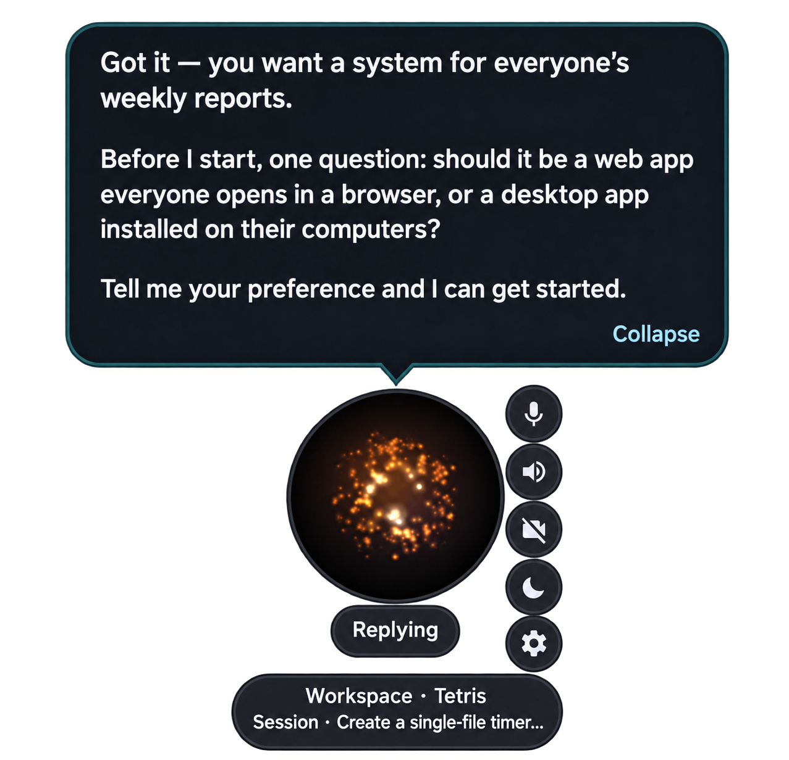
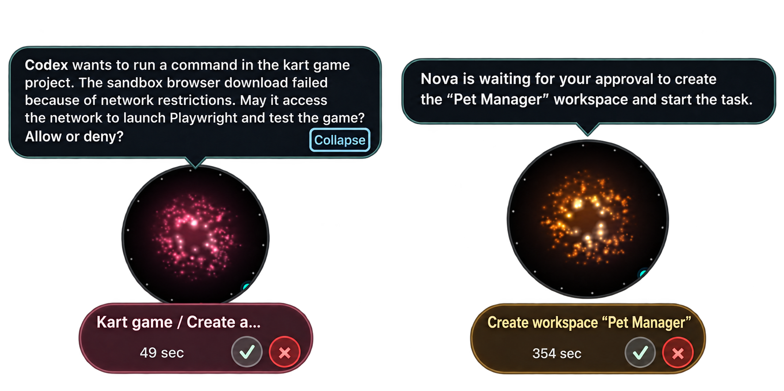
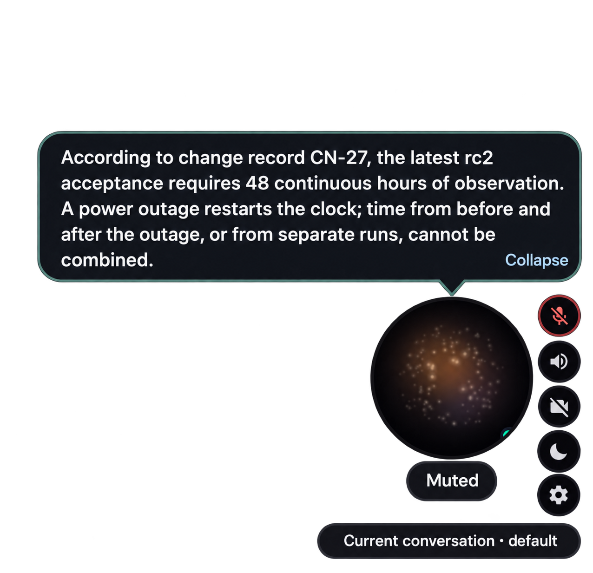
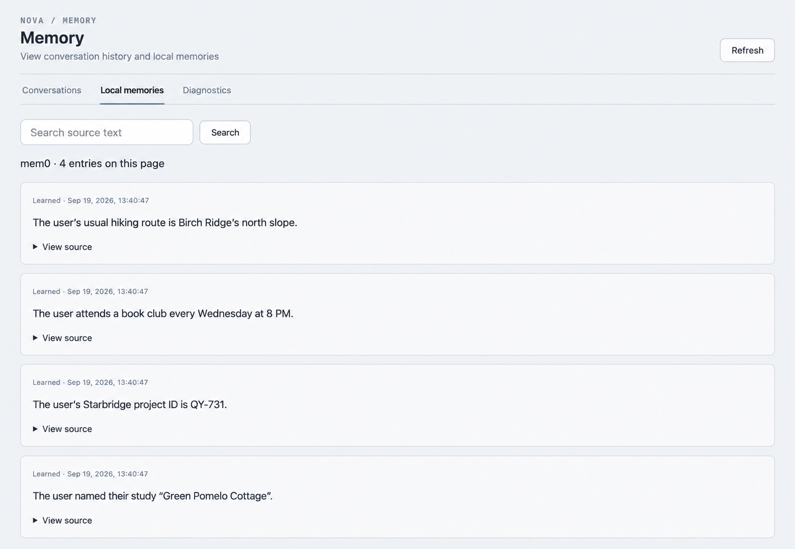
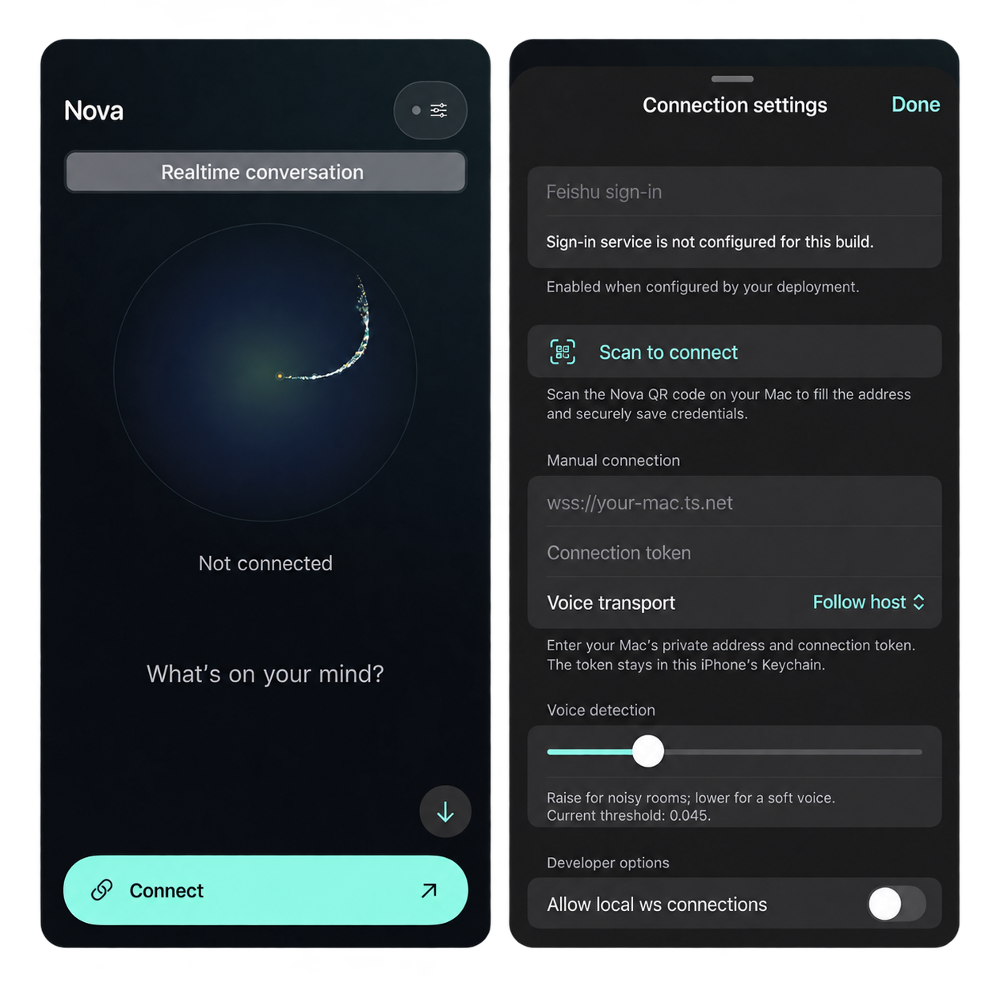

<!-- Keep in sync with README.zh-CN.md -->

# Nova Audio Agent

**English** | [简体中文](README.zh-CN.md)

[](https://github.com/deepnovacore/NovaAudioAgent/actions/workflows/ci.yml)
[](LICENSE)
[](package.json)
[](#2-architecture)
[](docs/blog/2026-08-proactive-voice-agent-design-space.md)


> **An always-on voice agent with restrained proactivity and the capability of workspace management.**


## News

- **2026-09-22 · v0.2.0**
  - Cross-platform approvals for sandbox network access and command execution.
  - A leaner voice layer; workspace/session scheduling moves into the coding executor.
  - Pluggable ASR / LLM / TTS pipelines, decoupled from QwenAudioRealtime.
  - Custom MCP servers for search and RAG; wake words “你好星核” and “Hi Nova”. Chinese/English interface and system prompts.
  - Personal memory with mem0 / VoiceMem, plus improved Workspace Graph.
  - An iPhone client connected to your PC runtime over Tailscale.
- **2026-08-31 · v0.1.0** — Always-on voice, background Codex tasks, live steering, workspace/session management, and selective progress updates.

## 1. Highlights

Nova Audio Agent is a **harness for an always-on, general-purpose voice agent**: Nova (小诺)
keeps responsive while doing long-running tasks in the background, reporting
**proper** progress at **proper** time.

A concurrent work [qwen-audio-agent](https://github.com/QwenAudio/qwen-audio-agent) answers
*how to keep an agent talking while it works*, while we ask a step further — **when is talking
worth it at all** (see the [historical design post](docs/blog/2026-08-proactive-voice-agent-design-space.md) for more details).


- **Restrained proactivity:** Not all words are created equal: trivial coding progress can stay quiet while milestones are reported. Vision Guard alerts have higher speaking rights and may preempt Nova playback, never user speech.
- **Workspace management.** No need to manage your workspaces manually as in codex, our agent does that for you. Workspaces/sessions can be created/switched via pure voice control(proposed and confirmed).
- **Revision-bound intake.** For under-specified requirements, host-owned intake slots clarify the request before dispatch. The M1.5c live validation gate is still pending; no token-saving percentage is claimed here.
- **Real-time steering**. Our codex executor is built upon native codex app-server instead of ACP, which allows real-time steering.
- **Local wake word.** Opt-in offline detection for “你好星核” and “Hi Nova” hides the idle orb and wakes it locally; see [setup](docs/getting-started.md#enable-a-wake-word).

## 2. Architecture

[](assets/ideas/v3/nova-audio-agent-runtime-chalkboard.png)

*One event loop, two model ports reading one ContextView, Memory as the shared blackboard,
Floor guarding the single speech path.*

Essential roles and ideas:

* **FrontBrain model**: the realtime model that interacts with users, using the minimal host/native surface to dispatch work, cancel it, confirm host proposals, recall memory, and search. Revision-bound intake slots remain host-owned.
* **Surrogate model**: decides **when to speak**. When events get written into memory or suggestion pool, the surrogate model judges whether it worth reporting to the users.
* **Memory and ContextView**: short-term events from different capabilities are stored in different channels. Only bounded evidence and intake facts are compiled into ContextView for FrontBrain.
* **Executors and controllers**: role-based manifests run asynchronous work; an AgentController registry owns model-facing controllers and hidden Vision watch/guard channels. Camera frames go directly to the selected VLM; monitoring owns its complete loop.

For more details about the architecture, check [Architecture](docs/architecture.md).


## Main Features

<table>
<tr><td width="36%"><b>Talk while work gets done</b><br>Assign tasks, clarify requirements, and follow progress without leaving the conversation.</td><td></td></tr>
<tr><td><b>You approve the next step</b><br>Review workspace changes, command execution, and network access.</td><td></td></tr>
<tr><td><b>Bring your tools and knowledge</b><br>Configure ASR / LLM / TTS and MCP; ask questions across your documents.</td><td></td></tr>
<tr><td><b>Memory that stays with you</b><br>mem0 recalls personal context across conversations, with source text you can inspect.</td><td></td></tr>
<tr><td><b>Take Nova with you</b><br>Connect your iPhone over Tailscale to talk and approve tasks on your PC.</td><td></td></tr>
</table>

<sub>Demo data; screenshots cleaned up and translated for presentation.</sub>

## 3. Quickstart

Requirements: Node.js 22+, npm, Git, a logged-in `codex` executable (app-server is the only
Codex transport).

Besides the shipped app from releases, you can also install using npm

```bash
npm install --global nova-audio-agent@0.1.1
# open the shipped app
novaaudio
# open the settings panel in the app
# get api key from dashscope and tavily to fill up
novaaudio config
novaaudio doctor
```


For development from source:

```bash
git clone https://github.com/deepnovacore/NovaAudioAgent.git nova-audio-agent
cd nova-audio-agent
npm ci && cp .env.example .env
```

Get API key from [DashScope](https://platform.qianwenai.com) and [Tavily](https://docs.tavily.com) . And then set `DASHSCOPE_API_KEY` and `TAVILY_API_KEY`.

```bash
npm run start:client
```
The client includes microphone, camera, sound, settings, and external MCP controls. Try hovering over the desktop orb to get surprised :) Also you
may try build or run demo locally:

```bash
npm run build --workspace @nova-audio-agent/runtime
node runtime/dist/src/cli.js diagnose --json
node runtime/dist/src/cli.js demo all
```

Native echo-cancelled capture (VoiceProcessingIO) is macOS-only. Wake detection uses that
capture when available; Windows, Linux source runs, and macOS fallback use Chromium
`getUserMedia` + AudioWorklet. While sleeping, microphone frames go only to the local
wake-word Worker; explicit mute stops wake detection. See
[wake-word setup](docs/getting-started.md#enable-a-wake-word).

## 4. Documentation

| Read this | For |
|---|---|
| [Architecture](docs/architecture.md) | Modules and boundaries |
| [Glossary and invariants](docs/glossary.md) | Vocabulary and rules |
| [Getting started](docs/getting-started.md) | Setup and integrations |
| [v0.2.0 specs](docs/specs/v0.2.0/00-overview.md) | In-progress feature contracts on `v0.2.0dev` |
| [Historical design exploration: A Tradeoff Ruler for Proactive Voice Agents](docs/blog/2026-08-proactive-voice-agent-design-space.md) | Historical design-space essay |
| [Node runtime migration archive](https://github.com/deepnovacore/NovaAudioAgent/tree/20a0812c0acb83b53cbad4b415d637dafff3c7f6/docs/archs/node-runtime-migration) | Migration-era plans in the history of tag `v0.1.0` |

## 5. Roadmap

- [ ] **v0.2.0 (`v0.2.0dev`):** cross-platform approval forwarding; fewer native FrontBrain tools with workspace/session coordination inside the coding executor; replaceable ASR/LLM/TTS and provider-neutral contracts; custom MCP, search/RAG and the Chinese wake phrase “你好星核”; VoiceMem for personal memory; native iOS connected to a PC runtime through Tailscale. Existing implementation and outstanding acceptance are tracked separately in the [specs](docs/specs/v0.2.0/00-overview.md) and [release gate](docs/specs/v0.2.0/RELEASE-GATE.md).
- [ ] **v0.3.0:** **Kimi Code + pi agent** coding backends; a **GUI executor with AutoGLM as the first example**, demonstrated through real agent2agent workflows; **Surrogate + Proactive + Memory** for memory-grounded need discovery and considerate follow-up. Retain the planned text/voice main window, feed/tasks/memory views, correctable personal memory and authorized sources; executor integration does not wait for mail/calendar connectors. See [specs](docs/specs/v0.3.0/00-overview.md), [milestones](docs/specs/v0.3.0/STATUS.zh-CN.md) and the [full roadmap](docs/archs/09-roadmap.md).

`v0.2.0dev` integrates after automated gates; `main` requires all feature and supported-platform
acceptance in the [release ledger](docs/specs/v0.2.0/RELEASE-GATE.md). Linux releases are deferred;
Ubuntu source tests remain.

## 6. Contribution

```bash
npm ci && npm run check && npm run build && npm test
```

Live integrations are credential- and hardware-dependent and never substitute for the
deterministic tests. Security reports: [SECURITY.md](SECURITY.md); contribution rules and
invariants: [CONTRIBUTING.md](CONTRIBUTING.md).

## 7. License

Copyright 2026 DeepNovaCore, [Apache License 2.0](LICENSE).
