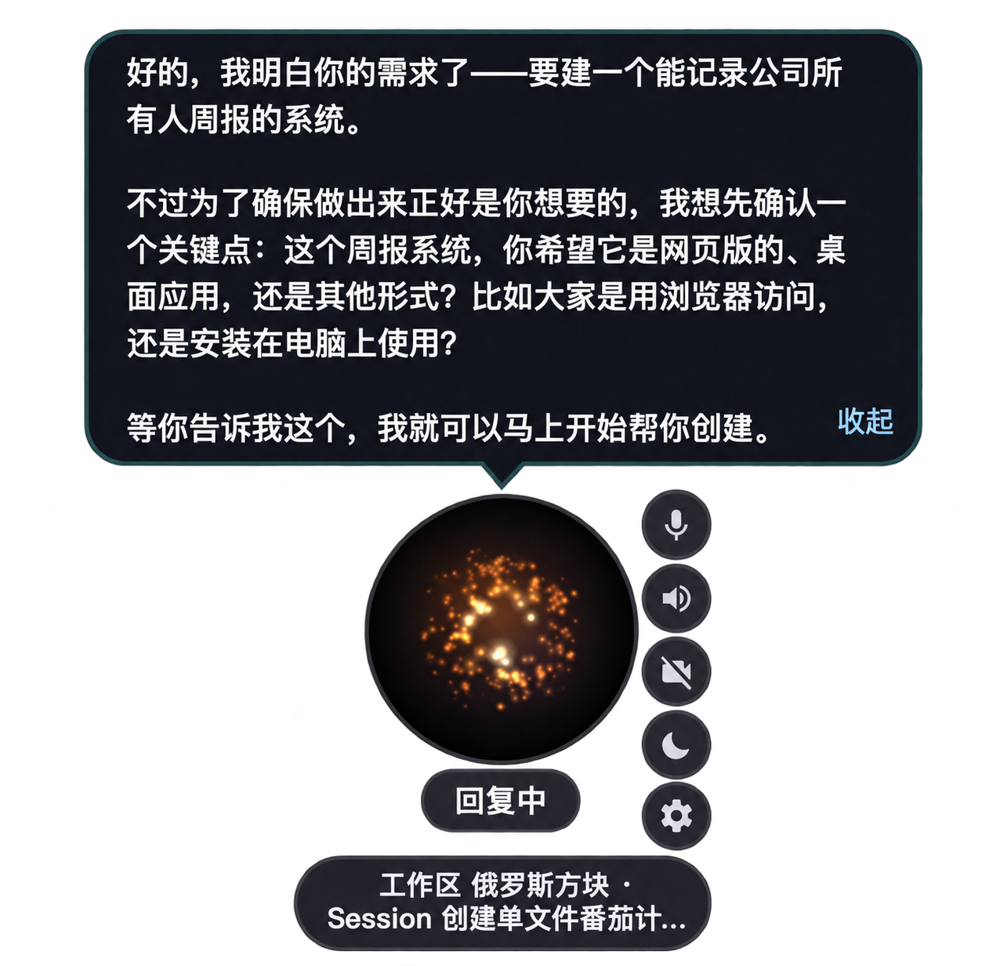
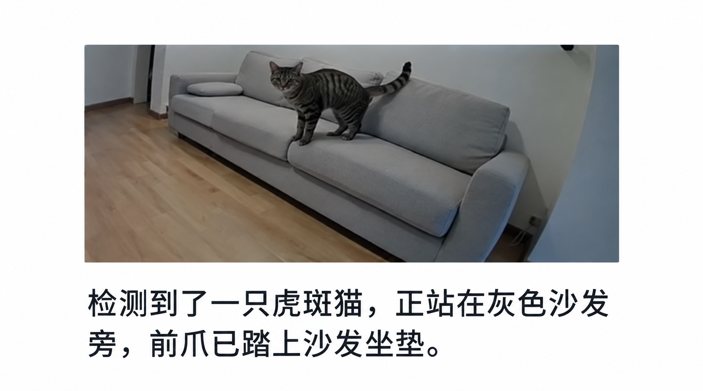
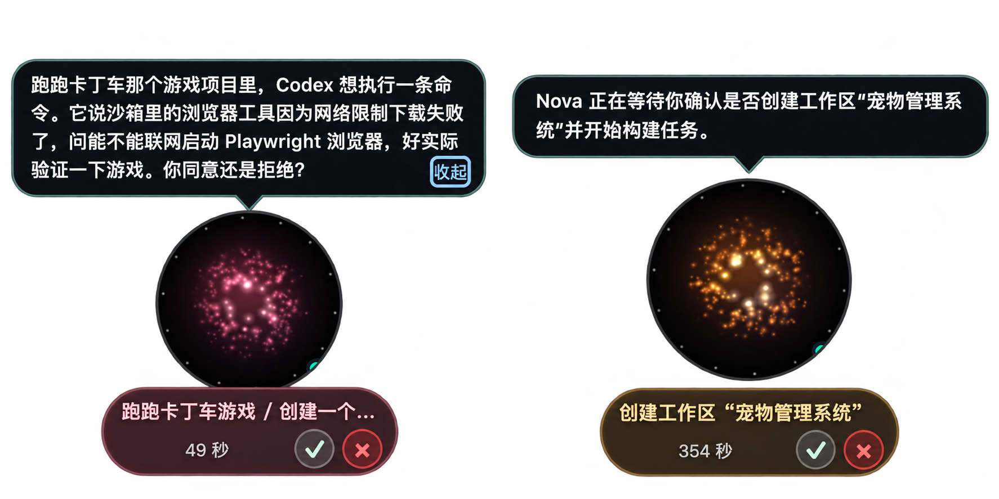
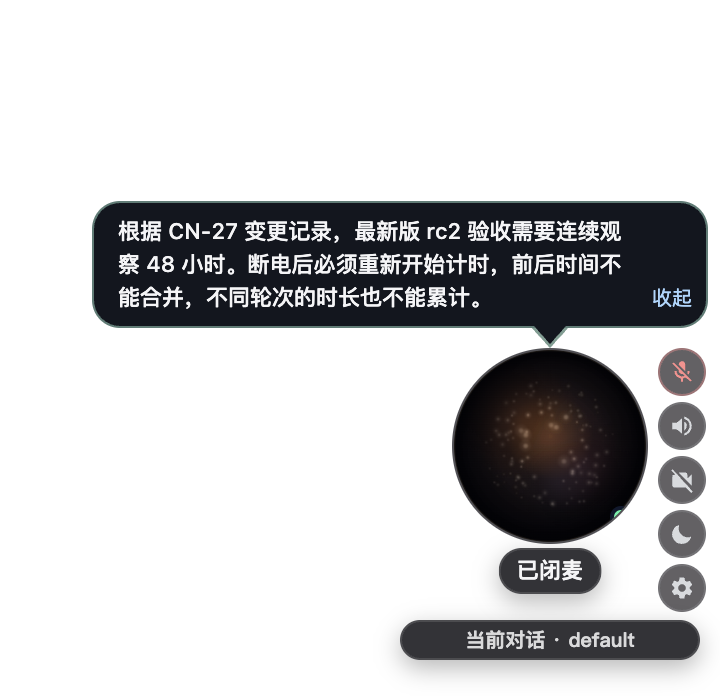
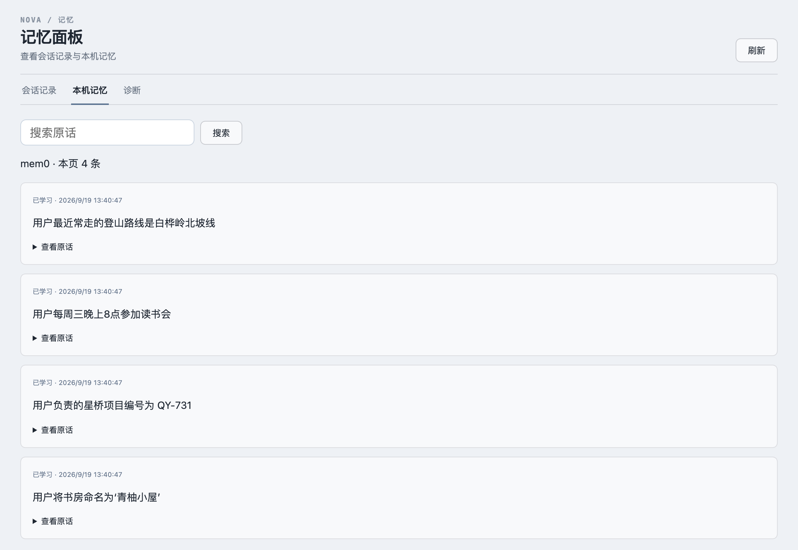
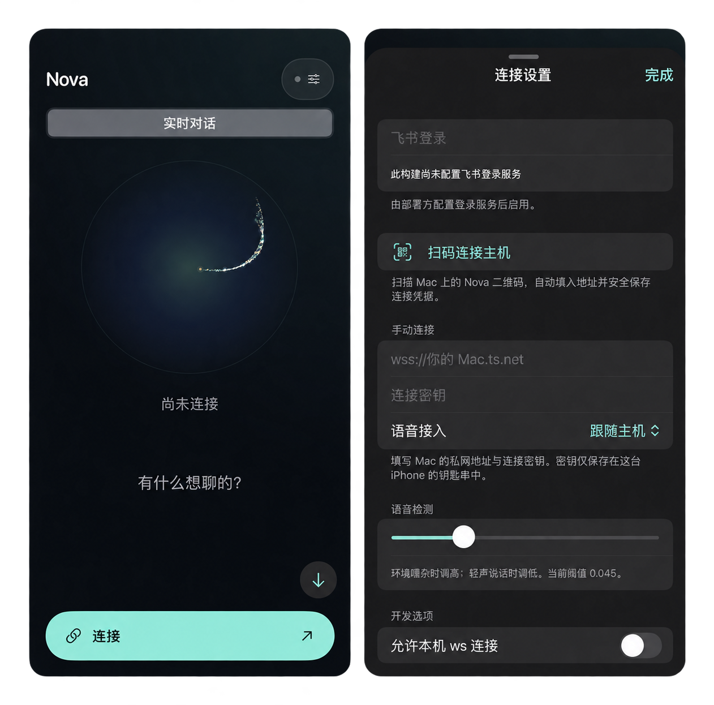

<!-- Keep in sync with README.md -->

# Nova Audio Agent

[English](README.md) | **简体中文**

[](https://github.com/deepnovacore/NovaAudioAgent/actions/workflows/ci.yml)
[](LICENSE)
[](package.json)
[](#2-架构)
[](docs/blog/2026-08-proactive-voice-agent-design-space.md)
[](https://youtu.be/t1c-2O-QsxE)


> **Agent 常驻在线、主动但是有分寸、通过语音帮你管理所有工作区 -- 干活不停，言语有度**

https://github.com/user-attachments/assets/061697f3-fff6-47d6-924b-8a29eef4ab45

## news

- **2026-09-22 · v0.2.0**
  - 完善跨平台审批：沙箱网络访问、命令执行等请求转交前台确认。
  - 精简快脑工具，将 workspace/session 调度下沉至编码执行器。
  - 接入可配置 ASR / LLM / TTS 的级联管线，协议与 QwenAudioRealtime 解耦。
  - 支持自定义 MCP、搜索与 RAG，中英双语界面与系统提示词，以及“你好星核” / “Hi Nova”唤醒词。
  - 接入 mem0 / VoiceMem 个人记忆，完善 Workspace Graph 工作区记忆。
  - 新增 iPhone 客户端，通过 Tailscale 连接电脑上的 runtime。
- **2026-08-31 · v0.1.0** — 常驻语音、Codex 后台执行、途中补充需求、工作区与会话管理，以及按需播报进度。

## 1. 核心特性

Nova Audio Agent **常驻通用语音 agent**：小诺（Nova）保持前台对话实时响应，同时在后台处理长任务，并在合适的时间汇报合适的进度。

同期工作 [qwen-audio-agent](https://github.com/QwenAudio/qwen-audio-agent) 回答的是
「怎么让 agent 边干活边说话」；我们在此基础上又追问了一层——**开口这件事，什么时候才值得**
（详见[历史设计探索文档](docs/blog/2026-08-proactive-voice-agent-design-space.md)）。


- **主动有分寸。** 重要进展及时说，琐碎过程保持安静，提醒不抢用户说话。
- **语音管理工作区。** 创建、切换工作区与会话，由你确认。
- **先问清，再动手。** 需求不明确时先澄清，再交给后台执行。
- **执行中随时调整。** 任务进行中，通过语音补充要求和约束。

## 2. 设计架构

[](assets/ideas/v3/nova-audio-agent-runtime-chalkboard-zh-CN.png)

*一个事件循环，两个模型端口共读一份 ContextView，Memory 当公共黑板，Floor 把守唯一说话通路。*

几个关键角色：

* **FrontBrain：** 实时前台模型，通过最小主机工具面派活、取消、确认主机提案、召回记忆和搜索；revision-bound intake slots 由主机拥有。
* **Surrogate：** 决定**何时开口**。事件写入 Memory 或建议池后，由它判断值不值得告诉用户。
* **Memory 与 ContextView：** Memory 短期、分通道；能力证据与 intake facts 受限编译进 ContextView 给 FrontBrain。
* **Floor：** 说话权。不同事件自带不同优先级。
* **Executor 与 Controller：** role-based manifest 运行异步工作；AgentController registry 拥有面向模型的 controller 及隐藏的 Vision watch/guard。主对话直接向当前 VLM 附图；视觉监控独立管理完整循环。
* **Compressor：** 对话变长后，短期记忆可能撑爆 FrontBrain 和 Surrogate 的上下文，Agent用摘要模型自动压缩。

架构细节见 [架构](docs/architecture.md)。


## 核心功能

<table>
<tr><td width="36%"><b>边聊边做</b><br>语音交办、澄清需求、查看进度，不用离开对话。</td><td></td></tr>
<tr><td><b>视觉监控与主动提醒</b><br>告诉 Nova 要关注的画面变化，条件触发时主动提醒。</td><td><br><sub>v0.1 演示 · 02:08</sub></td></tr>
<tr><td><b>操作由你确认</b><br>创建工作区、执行命令、访问网络，在前台审批。</td><td></td></tr>
<tr><td><b>接入工具与知识</b><br>自由配置 ASR / LLM / TTS 和 MCP，基于自己的资料问答。</td><td></td></tr>
<tr><td><b>记住与你有关的事</b><br>mem0 跨对话回忆个人信息，随时查看记忆与原话。</td><td></td></tr>
<tr><td><b>把 Nova 带在身边</b><br>iPhone 通过 Tailscale 连接电脑，随时对话和审批。</td><td></td></tr>
</table>

<sub>图中使用演示数据，部分截图已抠图、拼接。</sub>

## 3. 快速开始

环境要求：Node.js 22+、npm、Git、已登录的 `codex` 可执行文件（Codex 只走 app-server）

```bash
# 全局安装
npm install --global nova-audio-agent@0.1.1
# 启动客户端
novaaudio
# 打开设置面板（配置 dashscope 和 tavily api key）
novaaudio config
novaaudio doctor
```

从源码开发时：

```bash
git clone https://github.com/deepnovacore/NovaAudioAgent.git nova-audio-agent
cd nova-audio-agent
npm ci && cp .env.example .env
# 从 dashscope 和 tavily 获取 api key 并填入
```

启动桌面应用：
```bash
npm run start:client
```
客户端包含麦克风、摄像头、声音开关等按钮，以及设置面板和外部 MCP 设置。你也可以试试把鼠标悬在桌面 orb 上，会有惊喜）

从 [DashScope](https://platform.qianwenai.com) 和 [Tavily](https://docs.tavily.com) 获取 API Key 并配置 `DASHSCOPE_API_KEY` 和 `TAVILY_API_KEY`。

```bash
npm run build --workspace @nova-audio-agent/runtime
node runtime/dist/src/cli.js diagnose --json
node runtime/dist/src/cli.js demo all
```

原生回声消除采集（VoiceProcessingIO）仅 macOS 可用，唤醒检测在可用时复用该采集路径；
Windows、Linux 源码运行及 macOS 回退路径使用 Chromium `getUserMedia` + AudioWorklet。
休眠时麦克风帧仅送入本地唤醒 Worker，闭麦会停止唤醒检测。详见[本地唤醒设置](docs/getting-started.zh-CN.md#本地唤醒词)。

## 4. 文档

| 读这篇 | 目的 |
|---|---|
| [架构](docs/architecture.md) | 模块与边界 |
| [术语与不变量](docs/glossary.md) | 核心常量 |
| [上手指南](docs/getting-started.zh-CN.md) | 安装与集成 |
| [v0.2.0 规格](docs/specs/v0.2.0/00-overview.md) | `v0.2.0dev` 上进行中的功能契约 |
| [历史设计探索：A Tradeoff Ruler for Proactive Voice Agents](docs/blog/2026-08-proactive-voice-agent-design-space.md) | 历史设计博客 |
| [Node runtime 迁移归档](https://github.com/deepnovacore/NovaAudioAgent/tree/20a0812c0acb83b53cbad4b415d637dafff3c7f6/docs/archs/node-runtime-migration) | `v0.1.0` tag 历史中的迁移期计划 |

## 5. 路线图

- [ ] **v0.2.0（`v0.2.0dev`）：** 完善跨平台审批；减少快脑原生工具并将 workspace/session 调度下沉到 coding 执行器；支持可替换 ASR/LLM/TTS 及供应商解耦；自定义 MCP、搜索/RAG 与中文唤醒词“你好星核”；VoiceMem 服务个人记忆；通过 Tailscale 连接 PC runtime 的原生 iOS 客户端。已有实现与待验收项分别见 [规格](docs/specs/v0.2.0/00-overview.md) 和 [发布门槛](docs/specs/v0.2.0/RELEASE-GATE.md)。
- [ ] **v0.3.0：** coding 执行器接入 **Kimi Code + pi agent**；接入 **GUI 执行器，以 AutoGLM 为首个 example**，用真实闭环展示 agent2agent；扩展 **Surrogate + Proactive + Memory**，基于记忆发现需求并主动关心。同步保留文字/语音主窗口、动态/任务/记忆页、可纠正/忘记的个人记忆与用户授权来源规划；执行器不等待邮件/日历 connector。见 [规格](docs/specs/v0.3.0/00-overview.md)、[里程碑](docs/specs/v0.3.0/STATUS.zh-CN.md) 和 [完整 roadmap](docs/archs/09-roadmap.md)。

`v0.2.0dev` 通过自动化门禁即可集成；合入 `main` 前须完成
[发布台账](docs/specs/v0.2.0/RELEASE-GATE.md)中的全部功能与支持平台验收。Linux 暂不发布，保留 Ubuntu 源码测试。

## 6. 贡献

```bash
npm ci && npm run check && npm run build && npm test
```

安全问题见 [SECURITY.md](SECURITY.md)，贡献规则见 [CONTRIBUTING.md](CONTRIBUTING.md)。

## 7. 许可证

版权所有 2026 DeepNovaCore，[Apache License 2.0](LICENSE)。
