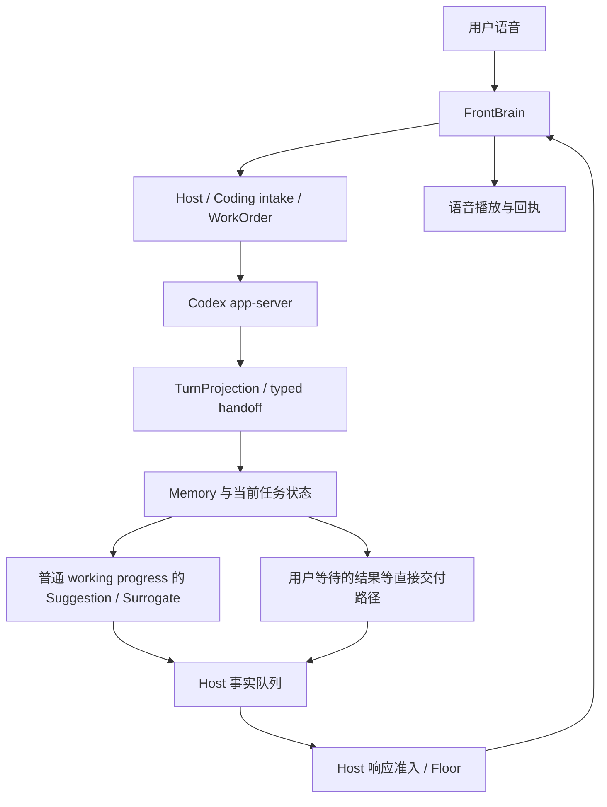

# GPT-Live / Codex Voice 对 Nova Audio Agent 的启发

日期：2026-09-07  
本地核对基线：`v0.2.0dev`，`aef12656051c3687c61e3ecd43701f1b0163727d`  
性质：基于公开资料与当前代码的分析和建议；本次只写文档，不修改运行时，不宣称建议已经实现或完成真人验收。

## 1. 结论

Nova 不缺“前台语音 + 后台执行”的架构，也不缺结果转述。最值得借鉴的是：**让执行端知道自己正在参与语音协作，从输出源头提供容易理解的进展与结论，再由现有前台结合对话表达。**

目前前台已经被要求自然转述，但 Codex 执行端的生产装配将 `developerInstructions` 设为 `null`。这不代表 Codex 没有其他系统或仓库指令，而是 Nova 这条装配路径没有提供专门的语音协作指令。传输层已经支持这个字段，不需要新增模型或另造协议。

建议优先做一次小范围对照：同一后台模型、同一 WorkOrder、同一前台与 Surrogate，仅改变执行端的表达指令。先确认是否改善信息质量，再决定要不要调整进度投影。保留 Host 的权限与生命周期、Surrogate 的开口判断以及 Floor 的播放仲裁。

## 2. GPT-Live 公开证据究竟说明了什么

| 证据 | 已能确认 | 不能据此断言 |
|---|---|---|
| [官方 Voice 说明](https://learn.chatgpt.com/docs/features/voice) | 在已有任务中开启语音，使用任务上下文和选定模型执行请求；可边交谈边检查、调整工作 | 所有账号和版本使用相同隐藏提示词或固定后台型号 |
| [realtime_start.md](https://github.com/openai/codex/blob/main/codex-rs/prompts/templates/realtime/realtime_start.md) | 默认后台模式指令告诉执行者：输出交给中间层，可能被总结；输入按转录理解；回答应简洁、面向行动 | 仅靠这段提示词就能获得 GPT-Live 的语音能力 |
| [backend_prompt.md](https://github.com/openai/codex/blob/main/codex-rs/prompts/templates/realtime/backend_prompt.md) | 这份名称容易误解的文件在指导前台：后台负责执行，前台负责自然交流；默认讲重点，不朗读复杂格式 | 该文件是在直接指导后台编码模型 |
| [realtime_delegation.rs](https://github.com/openai/codex/blob/main/codex-rs/core/src/context/realtime_delegation.rs) | 委托携带输入与可选的新增转录，存在有界包装 | 两边共享完全相同的上下文或全部原始音频 |
| [实时启动接口](https://github.com/openai/codex/blob/main/codex-rs/app-server-protocol/src/protocol/v2/realtime.rs) | 客户端可以传入给后台的语音开始/结束指令，也可以选择结果传递方式 | 公开默认配置就是当前桌面产品的完整部署配置 |

因此，“语音模式下后台感觉不一样”至少有两个可解释的来源：后台的受众和指令变了；前台又按当前对话选择重点、组织措辞。不能直接从风格变化推断后台权重换了。

这些 GitHub 链接指向可变的 `main`，是本次查阅的公开实现依据，不是对某个桌面安装包的逐字还原。第三方 [Daniel Vaughan 的概览](https://codex.danielvaughan.com/2026/07/24/codex-gpt-live-voice-control-desktop-multi-agent-coordination-hands-free-coding/) 可作背景阅读；其中固定后台型号的概括不应替代当前官方说明。[Voice Relay](https://github.com/hyungchulc/voice-relay) 是另一个可研究的公开实现，但不是官方 GPT-Live 的内部代码。

## 3. Nova 已有的能力：不应再建一遍

### 3.1 执行事实到用户耳朵已经是一条独立链路

当前主干可概括为：

这是职责示意，不意味着所有事件都必须经过 Surrogate。用户等待的结果与普通后台进度走不同策略。

代码依据：

- [`turn-projection.ts`](../../runtime/src/executors/codex/turn-projection.ts)：从 app-server 通知生成 started / working 进度与最终文本；进度摘要由计数和最近 prose 组合，有长度限制。
- [`service.ts`](../../runtime/src/realtime/service.ts)：`projectRuntimeEvent`、`onSuggestionSelected`、`#projectProgress`、`#projectHandoff` 决定哪些事实进入实时模型；包含身份校验、进度去重与终态处理。
- [`prompting.ts`](../../runtime/src/prompting.ts)：Surrogate 不生成用户话语，也不调用工具，只选择是否开口及对应 suggestion；普通内部活动不应因为“新”就播报。
- [`speech-prep.ts`](../../runtime/src/realtime/speech-prep.ts)：确定性清理 Markdown、代码块、URL 等，并裁剪语音投影。它不是语义总结器。
- [`frontend-instructions.ts`](../../runtime/src/realtime/frontend-instructions.ts)：明确要求自然口语、挑一两个要点、不朗读内部标识，不把进度说成完成。

GPT-Live 的“前台对后台结果进行自然表达”在 Nova 中已有对应机制。再加一个固定的润色模型，会多一次延迟和一次事实失真的机会，当前没有必要。

### 3.2 Nova 还拥有 GPT-Live 概览没有充分展开的宿主边界

Nova 的 Host 控制授权、任务生命周期和交付；事实播报不能调用动作工具，绑定用户请求的工具结果续接也仍需相应授权。Surrogate 只提供选择，不能提高事件优先级或批准执行。Floor 保护用户说话，播放回执用于确认实际播放状态。

这些边界见 [`architecture.md`](../architecture.md) 与 [`service.ts`](../../runtime/src/realtime/service.ts)。不能为了“像一个连贯的人”让前台自行决定任务已启动、已成功或用户已同意。

## 4. 真正值得改进的三个点

### 4.1 优先：在执行端明确语音协作要求

当前 [`factory.ts`](../../runtime/src/executors/codex/factory.ts) 的生产装配传入 `developerInstructions: null`；[`app-server-transport.ts`](../../runtime/src/executors/codex/app-server-transport.ts) 的 thread/start 与 thread/resume 参数构造已支持非空 `developerInstructions`。

这是一个已有接入点，而不是需要新建的机制。实施时应沿现有装配传递，并验证新建、恢复和后续 steer 的行为；不要修改用户全局配置，也不要把表达要求塞进 WorkOrder 挤占任务长度预算。

建议的指令草案如下，尚未安装到运行时：

> 你是 Nova 的任务执行者。用户主要通过语音与 Nova 交流，你的进度和结果会由前台转述。按工作单完成实际工作，保留显式约束、验收要求和完整交付物。进度优先说明新发现如何影响任务、已验证的阶段、阻塞或需要用户决定的事项，避免逐项播报命令和文件计数。最终回答先用简短自然语言说明结果、验证范围和仍未解决的问题，再提供必要细节及产物位置。简短不等于省略失败或不确定性；没有验证的内容不要说成已验证。授权与任务状态以宿主控制为准。

注意不能照搬“所有输入都是可能有错的转录”。Nova 的 WorkOrder 已经经过 intake，区分目标、约束、验收和假设；执行端不应以 ASR 纠错为由改写它。原始口述需要容错，已整理的任务契约需要保真。

也不要求每条进度恰好两句或全部输出 JSON。先让现有自然语言通道输出更有用的信息，用户要求详细解释时仍应给足细节。

### 4.2 其次：让有限的语音预算优先保留语义

当前 `AppServerTurnProjection.#composeSummary()` 将命令、文件、工具计数放在 prose 前面，再对组合文本做有界裁剪。计数能证明活动，但通常不能回答“现在发现了什么”。这构成可检查的信息预算问题，不代表本次已复现一个用户可见 bug。

此外，`prepareForSpeech()` 清格式后按字符裁剪；正文很长且限制条件位于末尾时，语音投影可能不含完整限定。单靠它无法判断哪句最重要。

最小路线：先要求后台把结论和限制前置；若对照仍显示摘要被计数挤占，再在现有投影函数调整顺序或预算，保留内部计数用于诊断。不要先新增摘要模型、统一消息平台或复杂分级 schema。

完整交付物与可听摘要应各有用途：代码、文档、验证结果继续留在原有任务/产物中；可听摘要帮助用户判断是否需要查看。当前链路本身也有文本长度上限，因此不能宣称 Memory 无损保存了所有 app-server 输出；重要长内容仍需可靠的产物入口。

### 4.3 评估连续对话，而不是只评估单条句子好不好听

Nova 前台已经要求“只转述最后一条尚未转述的 host 事实”，这是防止重播旧进度的约束。应保留事实选择的确定性，同时允许措辞承接用户刚问的问题。

例如，用户问“所以刚才卡在哪里”，新事实是依赖安装失败时，前台应直接解释这一阻塞；不应先说一遍“任务已启动”，再读计数，最后才说失败。用户问状态也不应被变成 steer。

本轮不建议放宽为“自由总结所有历史”。先用现有 active_executor_context、事实队列和明确的用户提问评估衔接效果，再决定是否需要极少量额外呈现上下文。不要在执行事实以外再维护一份独立的“叙事真相”。

## 5. 不应照搬的部分

| 做法 | Nova 的取舍 |
|---|---|
| 为了显得连贯，隐藏所有前后台区别 | 日常表达可以统一称“我”，但能力、失败、授权或执行归属需要说明时必须如实说明。不要安装“永远不解释后台”的禁令。 |
| 让前台决定每条后台更新是否值得说 | 保留 Surrogate 选择与 Host / Floor 准入，不让前台同时掌握事实、时机和权限。 |
| 把后台所有流式 token 都接成语音 | 当前中间活动不等于有用户价值。继续按有意义的事实和里程碑触发，防止重复和抢话。 |
| 让后台只输出极短摘要 | 语音可以短，实际交付与验证证据必须完整；不能为了好听丢掉限制和失败。 |
| 前台先总结任务，再让 intake 总结一次 | 现有前台要求原样传完整 instruction；WorkOrder 保留目标与约束。不要增加一层会损失需求的改写。 |
| 引入新的“语音协调 Agent” | 现有 FrontBrain、Surrogate、Controller、Host 已覆盖职责；目前无证据需要再加角色。 |
| 把语音表达更自然当作全双工能力证明 | 模型音频能力、端点检测、打断与播放恢复需要独立测试；提示词改进不能证明这些能力。 |

## 6. 最小验证方案与优先顺序

### 第一轮只比较执行端指令

固定模型、reasoning effort、工作单、仓库起点、前台指令和主动性档位。基线使用当前装配；实验组仅加入上述语音协作指令。测试修改任务时使用隔离目录，保证两组初始状态一致。

选择未用于调提示词的任务，每类至少复跑三次：

1. 简单修复成功：结论、验证范围清楚，详细产物仍可查看。
2. 工作尚未结束、一个阶段验证通过：允许说阶段完成，不能说整个任务完成。
3. 验证失败或环境阻塞：语音保留失败、范围和下一步，不用成功措辞掩盖。
4. 长结果末尾有“未做真人/平台验收”：可听摘要不能遗漏这一关键限定。
5. 用户只问进度：不新增执行、不误 steer，直接回答现有证据。
6. 用户途中补充约束：同一任务接收约束，最终结果保留新要求。
7. 多任务并行：按 Host 项目和任务身份播报，不根据摘要文本猜归属。
8. 用户要求静默或正在说话：普通进度不抢话、不破坏既有策略。

记录原始后台输出、投影事实、最终语音转录和播放时序，以判断改善究竟来自哪里。最重要的指标是事实与限定保真、任务身份正确、重复播报数量、每次播报的有效信息，以及从事实可用到开始播放的延迟。另行记录总任务耗时和交付完整性，防止用少做工作换取短回答。

先证明在不降低正确性和交付质量的前提下，语音更容易理解；不要凭少量样例宣称降低多少 token 或快多少。

### 后续实现时的检查范围

- 指令接线：检查 thread/start、thread/resume 与现有 launch validation；后续 steer 不应丢失约束或重复累积指令。
- 若修改投影：在现有 [`codex-turn-projection.test.ts`](../../runtime/test/codex-turn-projection.test.ts) 增加一条能暴露结论被截断的回归。
- 若修改清理：沿用 [`realtime-speech-prep.test.ts`](../../runtime/test/realtime-speech-prep.test.ts)，不另起测试框架。
- 若修改前台指令或交付：遵循其 golden/模型边界约束，并覆盖 [`realtime-service.test.ts`](../../runtime/test/realtime-service.test.ts) 中相应路径。
- 文本对照后再做真人语音测试：口语衔接、用户打断、扬声器回声和恢复不能由纯文本结果代替。

本次没有运行这些实验，也没有运行运行时测试；它们是后续实施的验收建议，不是完成记录。当前发布状态仍以项目现有发布台账为准。

## 7. 建议决策

先复用 `developerInstructions` 做执行端的语音协作对照，成本最低、因果最清楚。结果如果已经足够好，就停在这里；只有确认投影裁剪仍损失重要信息时，再改现有摘要投影。

Nova 应保留自己的核心分工：**执行端产出有依据的信息，Surrogate 判断是否值得开口，Host / Floor 决定能否交付，FrontBrain 用自然语言表达。** GPT-Live 最有价值的启发是让这几层在表达目标上配合得更好，而不是增加更多模型。
