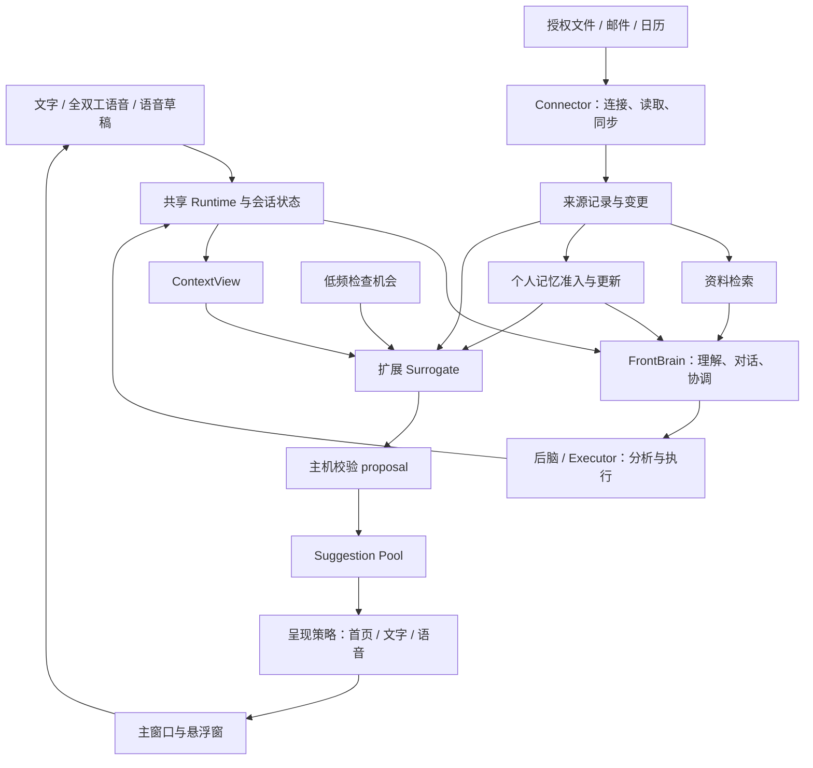

# Nova 个人 Agent：产品定位与架构设计

日期：2026-09-10  
状态：讨论稿；用于产品与技术评审，不代表功能已经实现或选型已经批准。  
当前代码基线：本地 `v0.2.0dev`。本文不改变已有公开与内部开发边界。

## 1. 产品主张

**Nova 是一个拥有持续记忆、能发现潜在需求并跟进事情的通用个人 Agent。用户可以打字、说话，也可以让它在后台工作。**

产品锚定三件事：

- **交互**：理解用户当前意图，支持主动交互，选择合适的呈现时机与方式。
- **记忆**：持续积累有来源、可纠正的理解，改善交互和需求判断。
- **前后脑协作**：前脑保持对话与协调，后脑承担耗时分析和执行。

语音是重要入口之一。桌面办公可以默认文字，移动场景可以优先语音；入口切换不应换一个助手，也不应丢失正在处理的事情。

首批产品定位是通用个人助理。Coding 是能力之一，不以开发项目作为所有交互的前置条件。首次使用不要求自我介绍，也不要求先连接数据源：用户可以直接开始办事。

### 已确认与待确认

| 事项 | 状态 |
| --- | --- |
| 通用个人助理定位；交互、记忆、前后脑为核心 | 已确认 |
| 支持文字、全双工语音、长按语音输入，共享背后架构 | 已确认方向 |
| 保留汇总重要变化、安排和建议的首页 | 已确认；不能因改名取消其定位 |
| 首页不使用 Today 的“今天”名称 | 已确认 |
| 首页暂称“动态” | 本文工作名称，尚未定稿；详见 v0.3.0 系列 |
| 主窗口可收起，使用现有语音悬浮窗继续交互 | 已确认方向，具体布局待评审；详见 v0.3.0 系列 01 卷 |
| 扩展 Surrogate 生成 proposal | 延续此前 PASK 讨论的推荐方案，尚未实现；详见 v0.3.0 系列 02 卷 |
| 第一组 connector 的 provider、平台发布顺序 | 待选；不影响本文职责边界 |

## 2. 用户获得什么

### 2.1 无需介绍，直接使用

用户打开 Nova 就能聊天或交办事情。需要更多资料时，Nova 说明用途，让用户选择文件、目录或连接账户。连接是可选增强，不是进入产品的门槛。

初次授权后，后台可以整理资料并形成初步理解，但不强行生成“完整人物画像”。资料不足时应承认覆盖范围；目录名提供的兴趣线索不能直接成为确定身份。

### 2.2 持续理解，适时发现

需求可以来自对话、任务变化、获准访问的资料和个人记忆。示例：

- 用户提过即将演示，当前任务出现关键失败，Nova 提议梳理演示风险。
- 邮件提出改期，与已有日历冲突，Nova 展示冲突和可选处理方式。
- 没有正在运行的任务，但近期记忆里有明确日期的安排，Nova 提出一次相关准备建议或关心。

发现需求不一定立即打扰。可以先出现在首页；必要时再用文字、通知或语音提醒。没有充分依据时允许不产生任何建议。

### 2.3 事情有连续状态

用户可以查看后台任务、补充要求、取消任务、处理等待自己的决定，并检查最终结果。主窗口和悬浮窗显示同一任务状态。

“已开始”“执行完成”“结果已验证”“已向用户呈现”是不同事实。产品不能用一条“已经安排好了”的话替代真实的执行结果。

## 3. 产品界面

推荐导航为 **动态 / 任务 / 记忆**，对话始终容易到达。连接与权限放在设置中，同时从相关内容提供直达入口。

### 动态：个人关注首页

保留参考产品首页的定位：把分散的信息整理成用户当前值得了解和处理的事情。

- 汇总近期安排、重要变化、待处理决定、主动建议与任务结果。
- 可以生成简报，但不限定为每天一次，也不是所有来源的流水账。
- 卡片展示发生了什么、为何相关、信息来源和更新时间，以及适合的下一步。
- 用户可展开依据、接着聊、开始处理、稍后再看或忽略；忽略反馈用于减少重复呈现。
- 旧消息得到新结果时更新同一事项；失去依据的建议撤回或标记失效。
- 空状态展示真实的“暂无新发现”和可选入口，不编造内容填满页面。

### 任务：执行与协作

任务承载真实工作及其进度、决定和产物。后台建议在用户采纳前仍是建议；有明确持续授权的自动任务另按其授权范围处理。

一个任务可以关联对话、来源、记忆和产物。首页是任务的摘要入口，详细进度和操作仍以任务记录为准。

### 记忆：理解与纠正

以用户可理解的主题展示事实、经历、偏好和进行中的关注点。允许摘要，但每项理解应能追溯来源和时间，区分明确表达与推断。

提供纠正、忘记和查看来源的操作。纠正不能只改 UI 文案：后续检索和未交付建议必须看到新状态。资料库保留源内容，记忆页展示从中形成的理解，两者不能混为一体。

### 主窗口与悬浮窗

主窗口借鉴 IDE 的可展开区域：导航、当前对话或事项、按需展开的来源与结果。具体视觉设计另行评审，不照搬参考产品的名称和页面外观。

收起窗口只改变呈现方式，不结束会话或取消后台任务。麦克风状态独立控制，收起不意味着允许持续采音。桌面静音时，主动内容仍可通过首页或文字呈现。

## 4. 当前能力与缺口

以下为本次阅读当前源码后的判断，不代表所有平台都已经通过真实设备验收。

| 子系统 | 现有基础 | 本轮需要补齐 |
| --- | --- | --- |
| Runtime / 前后脑 | 事件应用、异步执行、上下文投影、任务身份与授权边界 | 让入口、任务与持续发现协同工作 |
| 多种输入 | cascaded 客户端协议已有 text_input、dictation 能力声明 | 主窗口体验及跨入口状态一致性；不能假设 integrated 已等价支持 |
| 资料检索 | 文件、URL、文件夹授权导入，正文分块和检索 | 持续同步、来源变更、外部邮件与日历 |
| 个人记忆 | durable personal-memory 边界、来源 ID、召回和遗忘接口 | 外部资料准入、修订校验及用户可管理的展示 |
| 主动交互 | 执行器与观察结果入池，Surrogate 筛选，Floor 仲裁 | 从上下文和个人记忆生成新 proposal |
| UI | 现有桌面客户端与悬浮交互基础 | 动态首页、统一任务和记忆视图 |

关键代码入口：

- `runtime/src/ports.ts`、`model-adapters.ts`、`runtime.ts`：当前 Surrogate 只有选择契约，主机只接受本次提供的 suggestion ID。
- `runtime/src/suggestions.ts`：建议生命周期、证据引用、过期和冷却等机制。
- `runtime/src/context-view.ts`：同步编译当前上下文；不宜直接塞入异步远程检索。
- `runtime/src/memory/personal-memory.ts`：现有写入以可信对话轮次为单位，外部资料不能冒充用户发言。
- `runtime/src/knowledge/service.ts`：已有有界文件夹导入；不是全盘持续采集服务。
- `runtime/src/capability-registry.ts`：已有 MCP 配置及按消费者暴露工具的基础。

## 5. 目标架构



图中是职责边界，不要求每个方框成为独立服务。第一阶段沿用 Node/TypeScript runtime 和现有存储技术；按实际需要增加模块，不引入通用事件总线或新的多 Agent 平台。

### 5.1 共享核心，保留入口差异

文字、语音共享会话、任务、记忆、执行授权和事件处理。全双工语音仍保留端点检测、播放中断等专有逻辑。

长按语音先得到可编辑草稿；用户提交后才形成正式交互。全双工语音按其既有实时语义处理。共享架构不意味着强迫所有模式使用同一模型连接，或让纯文字依赖麦克风初始化。

主窗口和悬浮窗消费同一份主机状态。重新打开界面可以恢复当前会话与任务；UI 不自行维护另一份权威任务列表。

### 5.2 来源、记忆、建议、任务各有责任

| 对象 | 回答的问题 | 约束 |
| --- | --- | --- |
| 来源记录 | 实际读到了什么，什么时候读到 | 保留账户、原始 ID、版本、时间和可追溯链接 |
| 个人记忆 | 对用户形成了什么理解 | 保留依据与归属，允许纠正和遗忘；推断不升级为授权 |
| Proposal / suggestion | 为什么现在可能值得介入 | 是候选，需要校验、去重和失效处理 |
| 任务 | 已经承诺执行什么，进展如何 | 由现有执行与授权生命周期管理 |
| 首页事项 | 用户需要看见和处理什么 | 引用上述对象，保存忽略等用户状态，不复制执行真相 |

首页事项需要持久化；Suggestion Pool 负责候选与交付调度。不要直接将池子当成完整的首页数据库，也不要让首页点击绕过授权入口。

## 6. 需求发现：延续 PASK 讨论的最小方案

### 6.1 输入与触发

在相关上下文变化、来源发生变化或低频检查时，为 Surrogate 准备当前 ContextView、少量相关个人记忆和近期实际交付记录。

检索在适配层异步进行，完成后形成有界快照。快照携带用户/作用域及实际使用的记忆版本。低频检查也进入事件记录，以便解释和重放判断。时钟包含本地日期、星期与时区。

低频检查只代表获得判断机会，不代表用户空闲。没有正在运行的任务也应支持基于记忆的主动关心；没有依据时保持沉默。

### 6.2 扩展输出，复用建议池

保留现有 `speak / suggestion_id / progress_class / reason` 契约，追加可空 proposal。概念内容为：

```text
proposal:
  kind: notify | question
  summary: 建议内容
  why_now: 此刻相关的原因
  evidence_refs: 当前上下文中的依据
  memory_refs: 使用的个人记忆及其版本，可为空
```

这是建议的接口内容，不是已发布 wire schema。相比此前单一 `anchor_memory_id` 方案，外部来源场景允许只依赖当前证据；主机仍必须选定稳定的去重依据，不能靠模型摘要字符串判断重复。

一次判断可以沉默、选择已有建议或提出新 proposal；主机应验证互斥关系。`speak` 暂时保留兼容旧选择路径，不能被解释为新 proposal 必须立即朗读。

已有 coding progress 的分类路径保持原语义，不在第一阶段混入 proposal 生成；新需求由其他相关事件或低频检查发现。这样不破坏现有进度筛选与 offered-suggestion 校验。

### 6.3 主机准入与呈现

- 入池和交付前检查来源、作用域及记忆版本；已删除、修订或失效的依据使旧 proposal 失效或重新评估。
- 由主机分配候选 ID、有效期、优先级和去重键；模型不能自行扩大权限或提高打扰等级。
- 先保留此前的简单去重策略：对同一用户、作用域和稳定依据，在同一本地日期限制重复机会；不宣称语义去重或 exactly-once。
- 分别记录首页展示、通知和实际语音交付。入池、选择和实际交付不能合并成一个状态，也不能因为卡片渲染就认为用户已读。
- 来源更新、用户忽略或任务解决后，撤回相关候选并更新首页事项。

提问或建议不授权后台执行。明确提醒还需要可靠的提醒任务；机会性需求发现不承诺精确到点。记忆的发生时间也不能被当成未来截止时间。

## 7. Connector 与记忆采集

### 7.1 同一连接服务两个场景

Connector 同时支持用户按需查询和后台增量同步；共享账户、权限与 provider 实现。写操作是可选能力，经过既有执行授权路径。

MCP 是工具暴露方式，可复用现有 MCP server；但必须确认它是否真的支持稳定分页、变更、删除和恢复。只提供搜索工具不等于具备持续同步能力。

共同层管理连接状态、凭据引用、同步进度、重试与配额。Provider adapter 保留邮件线程、日历重复规则等领域语义，不把所有数据强制压成纯文本。

### 7.2 本地文件

用户选择允许的目录。先建立范围内的元数据概览，再按相关性、近期变化和预算读取正文；排除敏感路径、缓存和依赖目录，解析符号链接时重新验证边界。

后续处理增量变化，并在启动或恢复后补充核对。元数据和路径本身也属于受控内容。完整扫描量、解析失败和覆盖范围应可见，不能在只处理部分文件时宣称“了解了整台电脑”。

复用现有知识导入与检索能力；在其外围补持续来源管理，避免重写一套文档解析系统。

### 7.3 邮件与日历

以一个 provider 的邮件和日历验证闭环，再扩展生态。Google Calendar 与 Gmail 是候选，不作为本文已确认选型。

- 日历保留事件 ID、日历归属、时区、全天语义、重复规则、例外和取消状态。
- 邮件保留消息 ID、线程归属、参与人、时间、正文及适当的状态；是否待回复需要检查线程，不由一封历史邮件决定。
- 初次同步明确范围；后续保存 provider cursor。变化和 cursor 的持久化必须保证失败后可安全重试。
- 删除、取消与范围变化要传播到检索和关联建议。临时网络失败不能被当成来源内容已删除。
- 第一阶段可采用后台增量轮询；网络恢复后补同步。推送用于改善时效，不替代实际差量拉取。

Google Calendar 使用 syncToken，失效时需重新同步；Gmail 使用 historyId，历史过期时也需恢复同步。具体查询范围必须服从 provider 的增量参数限制。Microsoft Graph 后续可通过 delta 机制适配。[4][5][7]

### 7.4 授权与撤销

界面说明账户、读取范围、后台同步开关、模型处理方式和最近同步时间。凭据只由主机管理，模型和 renderer 不获得原始 token。

OAuth scope 与 Nova 内部范围限制分别展示；例如“只处理选定标签”可能是 Nova 自身执行的过滤，不能声称 provider token 只允许该标签。发信、创建邀请等按实际需要开放。[6]

区分三种操作：暂停同步保留已有内容；断开连接停止后续访问；删除来源数据清理其索引并处理派生记忆和建议。对仍有其他独立依据的记忆保留有效部分，不能简单删除所有相关历史。用户主动忘记的内容应防止下次同步立即重新生成。

外部内容始终是低信任证据，不作为系统指令或用户授权。采集与模型处理范围由主机实际执行，不能只写在提示词里。

## 8. 分阶段交付

| 阶段 | 产品结果 | 技术重点与退出条件 |
| --- | --- | --- |
| A：需求发现闭环 | 基于现有对话和个人记忆，生成有依据的建议；包括无任务场景 | 扩展 Surrogate、快照校验、入池及实际交付去重；先在现有入口验证 |
| B：统一桌面体验 | 主窗口提供动态、任务、记忆；可收起继续交互 | 共享会话和任务状态；文字不依赖音频初始化；首页状态可恢复 |
| C：持续来源 | 授权文件增量与一组邮件/日历连接产生有效发现 | 同步恢复、删除传播、多账户隔离；改期冲突完整场景通过 |
| D：扩展执行生态 | 更多 provider、Coding、AutoGLM、Home Assistant 等能力 | 逐项按既有执行边界集成，以真实闭环验收，不一次建插件市场 |

阶段 A 不依赖先完成所有 connector。阶段 B 的布局可以提前评审，但用户体验验收依赖真实共享状态。阶段 C 可先做读取与 Nova 内草稿，再加入有授权的写入。

第一阶段不建设：全盘无差别采集、默认持续屏幕录制、独立训练的需求模型、复杂习惯预测系统、通用 workflow 平台或多机自动容灾。现有用户明确请求的能力不因这些简化而删除。

## 9. 验收与效果判断

### 必须覆盖的场景

1. **直接使用**：不自我介绍、不连接资料，也能开始文字交互和交办事情。
2. **切换入口**：文字提交任务后收起窗口，语音继续询问同一任务；不重复创建工作。
3. **语音草稿**：长按输入的草稿可以修改，提交前不触发正式任务。
4. **任务内发现**：明确演示目标与当前失败共同支持风险 proposal，能追溯两类依据。
5. **无任务发现**：低频检查结合有效近期记忆生成一次相关提问；证据不足时沉默。
6. **不重复打扰**：重复事件、重试和程序恢复不会简单地再播同一条；交付失败不能冒充成功。
7. **记忆变化**：异步生成期间删除或修订记忆，旧 proposal 在入池或交付前被拒绝。
8. **来源变化**：邮件改期与日历冲突产生卡片；会议取消或问题解决后卡片更新、提醒撤回。
9. **同步恢复**：断网、限流、cursor 失效、重复分页可恢复；多账户记录不串用。
10. **权限边界**：外部邮件中的指令不授予执行权限；连接撤销后停止读取，删除后停止相关检索。
11. **静音与后台**：静音不停止任务；主窗口关闭不等同于进程仍常驻，UI 明确显示运行状态。

需求发现评估同时观察命中与遗漏：用包含“应提出建议”和“应保持沉默”的固定案例比较，避免只追求建议数量。记录用户采纳、忽略、纠正、重复提示和依据失效情况；默认保留本地诊断，不以收集私人原文作为产品遥测前提。

产品成功是用户减少遗漏、顺畅完成事情并愿意纠正和信任记忆。记忆条数、connector 数量和每天生成的卡片数量不单独作为成功指标。

## 10. 部署边界与后续决策

推荐先沿用本地主机运行：主窗口收起时后台继续工作；应用进程退出、机器休眠或离线时不能承诺持续发现。恢复后补同步与检查。

如果产品要承诺电脑关机后仍持续运行，需要另行确定常驻服务器及跨设备权限、身份与同步方案；本文不隐含此能力。云端模型处理也应与本地存储分别说明。

公开版本只包含通用能力和用户配置的连接。组织专属工作流、内部服务与数据继续留在 internal；不随通用 UI 或 connector 设计进入公共分支。

下一轮评审需要确定：

- 首页最终名称与主窗口布局。
- 第一组邮箱/日历 provider，以及先发布的平台。
- 是否采用“本地主机运行”为首版明确承诺。
- 首版写入能力范围，以及机会性提示的默认节奏。

这些选择影响交付范围，不改变“共享交互核心、带来源的记忆、需求发现、主机授权执行”这条主线。

## 11. 参考与证据范围

参考产品启发功能定位，不证明其内部实现。本次未发现 Today 公开的文件扫描算法；“元数据概览后选择性阅读”是 Nova 的建议方案，不是对 Today 的技术事实断言。

1. [Today 官网](https://today.ai/) 与 [隐私政策](https://today.ai/privacy)：记忆、主动帮助、连接和云端处理的公开描述。
2. [PASK](https://github.com/xzf-thu/Pask)：需求检测、记忆建模和主动执行的分工；本文延续此前讨论，以扩展现有 Surrogate 为最小落点。
3. 开源工程参考：[Khoj](https://github.com/khoj-ai/khoj)、[Screenpipe](https://github.com/screenpipe/screenpipe)、[Onyx Gmail connector](https://github.com/onyx-dot-app/onyx/blob/main/backend/onyx/connectors/gmail/connector.py)、[OpenClaw Gmail webhooks](https://docs.openclaw.ai/cli/webhooks)、[Pipali](https://github.com/khoj-ai/pipali)。分别参考检索、活动采集、同步恢复、事件触发和桌面任务体验；不默认引入这些项目的代码或依赖。
4. [Google Calendar 增量同步](https://developers.google.com/workspace/calendar/api/guides/sync)。
5. [Gmail 同步](https://developers.google.com/workspace/gmail/api/guides/sync) 与 [推送](https://developers.google.com/workspace/gmail/api/guides/push)。
6. [Gmail scopes](https://developers.google.com/workspace/gmail/api/auth/scopes)：公开应用授权与数据处理要求需在 provider 和部署选定后复核。
7. [Microsoft Graph delta](https://learn.microsoft.com/en-us/graph/delta-query-overview)。

本文只新增设计文档；不宣称 runtime、客户端或 connector 已按此方案改造。

## 12. 2026-09-10 决策记录

同日脑暴确认以下七条决策，并以本文为起点新开 [v0.3.0 spec 系列](../specs/v0.3.0/00-overview.md)。
本文保留为背景与参考来源；契约、里程碑与验收以 v0.3.0 各卷为准。

1. **两条轨道并行、各自小步**：A 轨需求发现闭环（02 卷），B 轨主窗口与多入口（01 卷）；开工前先钉住契约对象。
2. **桌面默认 cascaded 管线**：文字与语音共用同一个 LLM 会话；integrated 保留为可选的纯语音低延迟模式，选中时文字输入置灰并说明原因。调研表明 Nova 使用的 Qwen-Audio-Realtime 系官方文档支持带 `input_text` 的 user message，因此置灰不是协议层限制；但完整文字轮次、取消与交付语义未验证，是否补齐及如何验证列为待评审（01 卷 §1.1、§4）。
3. **记忆页以结构化条目为主，概览可选**：每条含来源、时间、stated / inferred，可纠正可忘记；概览必须声明依据条数与来源范围（03 卷）。
4. **主窗口从现有 Electron 桌面长出，悬浮窗为收起态**：不新起客户端，不以 WebUI 为主窗口；左侧常驻对话列，右侧 动态 / 任务 / 记忆 三 tab；视觉布局待评审（01 卷）。
5. **同一输入框三态**：打字 / 长按录音成可编辑草稿 / 全双工实时转写，分别映射 `input.text` / `input.dictation` / `input.audio`（01 卷）。
6. **两个主机拥有的契约对象**：`feed_item`（02 卷）与 `memory_entry`（03 卷）；UI 不持有权威副本；任务沿用 `EXECUTOR_TASKS`。
7. **新开 v0.3.0 系列，里程碑从 M5 续编号**：M5-A / M5-B 并行，M6 依赖契约，M7–M8 为来源，M9 为执行生态（[STATUS](../specs/v0.3.0/STATUS.zh-CN.md)）。

本节只记录决策；未改代码。


## 13. 版本范围补充（2026-09-10）

本轮版本规划保留上述产品方向，并明确执行生态的交付顺序：v0.2.0 收敛审批、薄快脑/coding
调度、可替换级联管线、MCP/RAG/中文唤醒、VoiceMem 与 Workspace Graph、iOS/Tailscale 基础；
v0.3.0 明确加入 Kimi Code、pi agent、GUI/AutoGLM example 与 agent2agent 演示，协同推进
Surrogate 的记忆驱动需求发现与主动关心。M9 不依赖 M7/M8；Home Assistant 为后续候选。
以 [版本 roadmap](../archs/09-roadmap.md)、[v0.3 总览](../specs/v0.3.0/00-overview.md) 与
[执行器规划](../specs/v0.3.0/05-coding-and-gui-executors.md) 为本次补充后的范围入口。
本节更新规划，不宣布实现或验收完成。
