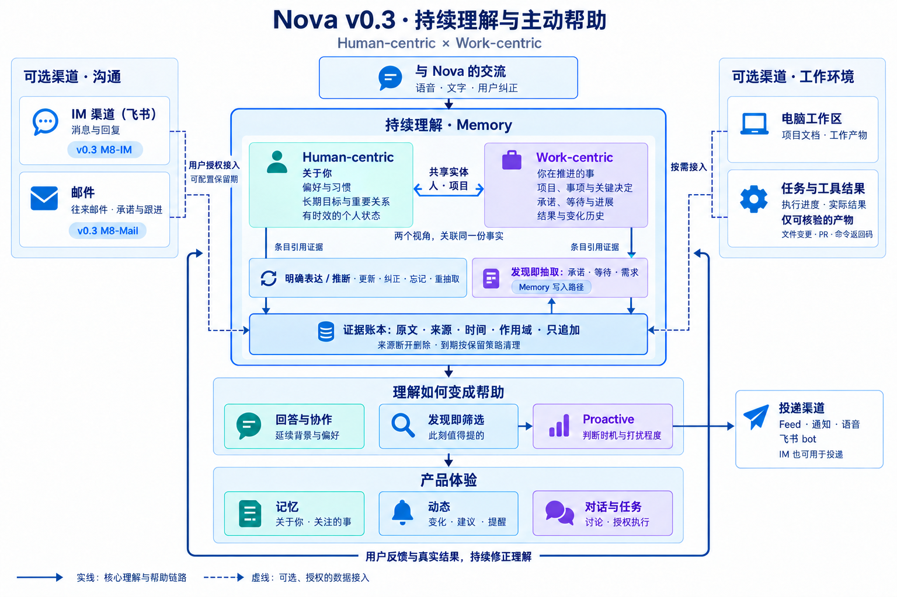
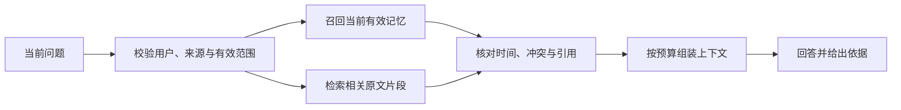

# Nova v0.3：持续理解与主动帮助

> 讨论整理 · 2026-09-12 · 架构设计，非已实现能力清单。
>
> 目标：持续理解这个人，以及这个人正在推进的事情；让回答更贴切、背景能延续，在值得帮助时主动接上。用户能够看到理解的依据，并通过纠正改变后续行为。

## 1. 产品方向

Nova 的记忆围绕两个视角组织：**Human-centric（关于你）**与 **Work-centric（你在推进的事）**。它们关联同一份事实，共享人物、项目等实体，不分别维护两套互不相通的用户档案。

关于人的理解包括偏好、习惯、长期目标、重要关系，也包括有时效的状态。关于工作的理解包括项目、事项、关键决定及其原因、承诺、等待、进展和结果。工作区是信息来源和执行环境；一件事可以跨多个工作区，一段对话也可以同时影响两个视角。

例如，用户明确说过“普通跟进集中提醒，不要逐条打断”，这属于个人偏好；用户答应周五交付方案、目前还在等一个关键回复，这属于工作事项。Nova 应综合两者，选择合适的提醒时机和方式。

关键词和标签用于导航、聚合与检索。更重要的是说明：用户在意什么、事情进行到哪里、最近发生了什么变化、理解有什么依据。目录名不能直接成为职业或人格判断，一次情绪表达也不应固化为长期特征。

现有实现只影响迁移成本，不决定产品方向。参考项目提供可借鉴的方法，不按项目名称各建一层。近期直接在 Nova 中推进 IM 场景，不另起独立实验，也不以全盘扫描或大量预制素材为前提。

## 2. 架构总览

产品视角是“渠道 → Memory → 帮助 → 体验”。Memory 内部按数据如何变化分为三个阶段：证据只追加，理解受控修订，投影只读重算。它们是逻辑边界，不意味着三个服务或三套数据库。

下面的分层图是本次讨论的最新文字版；从下往上读取。

```text
┌─ 顶层：交流表现 ─────────────────────────────────────────────────────────────────┐
│  回复风格 / recall 工具 / proactive 提议 / 记忆页                                │
│  只读投影；理解写回统一经用户纠正（含明确修订、忘记）                            │
├─ 中层 C：投影与预算（只读重算） ─────────────────────────────────────────────────┤
│  reply_preferences（同步） / memory__recall（按需）                              │
│  proposal 候选（tick / 变化触发） / memory_entry 列表                            │
│  发布快照；降级仅用仍有效的上一份，撤回与权限变化即时生效                        │
├─ 中层 B：派生记忆（受控合并） ───────────────────────────────────────────────────┤
│  kind = 人的事实/偏好 | 工作实体/线索 | 承诺/待办 | 标签                         │
│  每条：evidence_refs[] / origin(stated|inferred) / version                       │
│  共享实体：人 · 项目；Human-centric ↔ Work-centric                               │
│  唯一写入口：merge(ADD / UPDATE / DELETE / NOOP)                                 │
│  发现即抽取；更新 / 纠正 / 忘记 / 重抽取，保留修订历史                           │
├─ 中层 A：证据账本（只追加） ─────────────────────────────────────────────────────┤
│  原文 + 归一化观测：source_id / cursor / ts / hash / sensitivity                 │
│  来源 · 时间 · 作用域 · 保留期；模型不改写既有原文                               │
│  来源断开 = 墓碑 + 级联失效；物理清除另走数据管理路径                            │
├─ 底层：信息源 ───────────────────────────────────────────────────────────────────┤
│  对话 / 授权目录 / 邮件 / 飞书 / 钉钉 / 可核验的执行器结果                       │
│  连接器只做一件事：把变化写成证据                                                │
└──────────────────────────────────────────────────────────────────────────────────┘
```

### 产品架构图



这是本次讨论最后生成的图片，使用内置 imagegen 生成并随文保存。图中“来源断开删除”沿用了上一轮文案；最新分层约定为**来源断开 → 墓碑与级联失效**。逻辑失效与物理清除的区别见第 7 节。图片中的条目引用线表示依赖关系，不表示条目经抽取器写回原文；准确的数据方向以下文为准。

## 3. 信息源：把变化写成证据

渠道接入是可选能力。用户选择来源、账户、处理范围和保留期，连接器负责获取变化、保留来源语义、记录同步进度，将内容归一化为证据。它不直接写个人偏好、待办结论或提醒。

| 来源 | 有价值的信息 | 本轮定位 |
|---|---|---|
| 与 Nova 的对话 | 明确表达、偏好、目标、决定、纠正 | 持续理解的直接入口 |
| IM：飞书 | 消息、回复、参与人、会话上下文、承诺与等待 | v0.3 M8-IM，近期切入 |
| 邮件 | 往来线程、附件线索、承诺、待回复事项 | v0.3 M8-Mail；具体提供方另定 |
| 电脑工作区／授权目录 | 文档、项目资料、工作产物及其变化 | 按需接入，不作为 IM 场景的前置条件 |
| 钉钉等其他 IM | 与飞书类似的沟通证据 | 可扩展来源，不表示本版已经接通 |
| 执行器结果 | 文件变更、PR、提交、命令返回码等 | 仅接收可核验的产物与运行事实 |

IM 和邮件必须保留发送人、线程或会话、原始消息 ID、发生时间及原文定位。只读到一条历史消息，不能据此认定事情现在仍未完成；临时同步失败也不能被视为来源撤回。重复同步、消息编辑、删除及中断恢复都要有明确处理方式。

对执行器，模型说“已经修好了”不是执行证据。命令成功返回只证明该命令的运行结果，创建 PR 只证明 PR 存在，都不能自动推导出部署完成或用户验收通过。

### IM 同时可以是入口与出口

飞书作为来源读取授权范围内的沟通内容；飞书 bot 作为投递渠道，把 Nova 已决定交付的提醒发给用户。两者分别授权，读取许可不包含发送许可。

Feed、系统通知、语音和飞书 bot 使用同一事项与交付历史，分别记录实际交付结果，避免换个渠道重复打扰。经身份校验的用户回复可以表达完成、稍后或忽略；普通聊天原文不能自动成为执行授权。

公共设计只描述通用、部署时配置的连接器，不包含组织专属账户、群、机器人或内部工作流。具体接入仍需遵守仓库的公共与内部开发边界。

## 4. 中层 A：证据账本

证据账本是“有迹可循”的持久落点，保存经过敏感内容处理、在授权范围内允许保留的原文，以及来源与版本信息。抽取失败不能导致原始证据丢失。

| 信息 | 用途 |
|---|---|
| 稳定证据 ID、`source_id`、原始记录 ID／定位符 | 条目引用、定位出处、来源级操作 |
| `cursor`、内容 `hash` | 增量恢复、去重与重放 |
| 发生时间、入账时间 | 区分事情发生与系统得知的时间 |
| 用户／账户／授权作用域 | 隔离数据，约束读取范围 |
| 原文、`sensitivity`、保留期限 | 支持追溯、重抽取和内容清理 |
| 来源修订与撤回记录 | 使旧证据停止参与当前理解 |

“只追加”约束正常写入：新版本另记，历史原文不被模型改写。来源撤回写墓碑；物理清除属于专门的数据管理操作，不受正常追加写入规则限制。

模型抽取的候选结论是派生结果，不能伪装成新的独立证据。来源中的指令也是被观察的内容，不能借入账获得系统权限。

## 5. 中层 B：派生记忆

派生记忆回答“Nova 目前怎样理解这些证据”。每条理解至少具备稳定 ID、版本、类型、`evidence_refs[]`、`origin`，并按需要关联实体、适用范围和有效期。

| 内容类型 | 示例 | 注意事项 |
|---|---|---|
| 人的事实与偏好 | 偏好先讨论设计；普通提醒集中投递 | 明确表达与推断分开，偏好有适用范围 |
| 工作实体与线索 | 项目、人物、决定、阻碍、相关资料 | 一个事项可跨对话、邮件和工作区 |
| 承诺与待办 | 我答应了什么；我在等谁 | 保留对方、状态、约定时间及其依据 |
| 标签与主题 | 近期关注的技术或项目方向 | 用于组织信息，不直接当作身份结论 |

### 两个视角共享实体

承诺中的“张三”与重要关系中的“张三”应指向同一个人物实体。先使用来源提供的稳定标识；跨来源关联需要明确证据，不能仅凭同名合并。无法确定时保留两个实体和待确认关系。项目也适用同一规则。

### 唯一写入口：merge

抽取器只产生候选，统一由 `merge(ADD / UPDATE / DELETE / NOOP)` 决定如何更新当前理解。动作表示新增、修订、撤回与无变化；可以通过追加修订记录实现，保留旧版本。

用户纠正也经这条路径处理：先作为新证据入账，再形成修订，更新投影并使依赖旧版本的建议失效。重抽取不能无声覆盖用户的明确纠正；出现新的冲突时应保留依据并请求澄清。忘记还需要抑制重复派生，避免下次同步或换模型后重新生成同一条理解。

`stated` 表示当事人明确表达，`inferred` 表示系统推断。表达是否明确与来源是否可信是不同维度：明确说出的第三方要求不等于用户已承诺，模型置信度也不等于授权。

### 发现即抽取：Memory 的写入路径

消息入账后，从原文及必要上下文中抽取承诺、等待、需求、实体和时间，再交给 merge。不能把“希望你周五发来”直接当成“你已答应周五交付”，也不能把别人引用的一句话当作本人承诺。

保留原文支持**重抽取**：换模型或修正抽取逻辑后，可以重新理解仍在有效范围内的旧证据。重抽取保留历史、遵守用户纠正与忘记约束；原文已清除的部分不能声称可完整重建。

## 6. 中层 C：投影与预算

这一层把派生记忆的当前有效状态整理成不同消费者需要的有限内容。它可以重算，不直接改变权威记忆。

| 投影 | 使用方式 | 内容与预算 |
|---|---|---|
| `reply_preferences` | 同步读取 | 少量稳定、相关的回复偏好 |
| `memory__recall` | 对话按需调用 | 与问题相关的条目、证据与版本；限制数量和上下文长度 |
| proposal 候选 | `tick`、来源或事项变化时 | 此刻可能值得关注的少量事项 |
| `memory_entry` 列表 | 记忆页分页读取 | 用户可读的理解、来源、状态与修订信息 |

快照发布后供消费者只读。计算或服务短暂失败时，可以使用上一份**仍被授权、未被撤回**的快照并标明降级。来源断开、用户忘记、权限变化不能被“旧快照兜底”绕过；必要时应停止返回相关内容。

### 发现即筛选，与 Proactive 的分工

筛选从当前记忆、时钟、新变化和处理历史中找出“此刻值得提的”。Proactive 再判断是否打扰、何时交付、采用何种方式。发现候选不等于必须提醒。

没有新价值时保持安静；时间、依据或状态变化时更新同一事项。忽略只表示不想看，不代表完成；未发现完成消息只能表述为“尚未发现完成记录”。用户明确交办的定时提醒属于可靠任务调度，不能仅靠低频筛选保证准时。

## 7. 纠正、撤回与删除

“只读投影，写回只有用户纠正”描述的是对**记忆理解**的写回。完成、改期等改变理解的动作也作为明确用户输入入账。已展示、稍后、忽略、发送失败等操作状态有自己的处理与交付记录，不应自动变成人格偏好，也不允许表现层直接修改 B。

| 动作 | 对数据与后续行为的影响 |
|---|---|
| 暂停同步 | 暂停新读取；保留既有数据，显示同步时间与状态 |
| 断开来源 | 按本轮最新约定，撤销访问并记录墓碑；对应证据退出有效读取范围，级联失效到索引、记忆、快照和待发建议 |
| 删除来源数据 | 物理清除规定范围内的原文及相关副本、索引和派生内容；不能用逻辑墓碑宣称已清除 |
| 保留期到期 | 按来源策略清理原文及副本；标记追溯和重抽取能力变化，重新判断相关理解是否仍可用 |
| 用户纠正／忘记 | 通过证据和 merge 生成新状态，撤回依赖旧状态的建议；忘记还阻止重复生成 |

一条理解如果有多个独立来源，应移除失效支持后重新判断有效部分，不能因还有一个来源就保留整个旧结论。断开后是否立即物理清除、保留期具体数值及派生内容清理范围，还需要在实现契约中统一；本设计不把墓碑等同于隐私删除。

## 8. RAG 在架构中的位置

RAG（检索增强生成）是一条读取和回答路径，不是 Human-centric 之外的第三套记忆。它既可以检索资料原文，也可以召回当前有效的派生记忆，再组织有依据的回答。

| 对象 | 保存什么 | 解决什么问题 |
|---|---|---|
| 资料与证据 | 文件、消息、邮件及其出处 | “原文究竟怎么说？” |
| 派生记忆 | 有版本、有依据的当前理解 | “这件事现在怎样？为什么这样决定？” |
| 检索索引 | 全文索引、分块、向量和实体检索结构 | “怎样快速找到相关内容？” |
| RAG 回答 | 本次问题需要的记忆与原文片段 | “怎样结合这些内容回答？” |

基本路径如下：



“上次为什么改方案”通常先找决定及其证据；“文档里接口参数是什么”主要检索原文；“现在有什么值得跟进”则需要事项状态、时间与交付记录，不能只靠相似度搜索。

索引是可重建的读取设施，不拥有事实。引用旧原文时要标明时间，不能覆盖用户已纠正的当前理解。来源失效必须同时约束全文、向量、缓存和记忆召回。RAG 生成的回答不自动入账，避免模型引用自己的话逐渐形成伪证据。

现有资料库可以继续提供解析、分块与检索；原文最终由资料库还是账本保存，需要明确唯一的权威位置和清理责任，不让两套副本各自独立更新。无需为了逻辑分层预先引入独立向量数据库。

## 9. 顶层体验与第一条落地路径

用户通过回复风格、recall 工具、主动提议和记忆页感受到持续理解。记忆页显示“关于你”和“你在推进的事”，可查看依据和纠正；动态页呈现值得关注的变化；对话与任务承接讨论及授权执行。

近期从飞书里的两类事情切入：**我的承诺**与**我在等的事**。邮件沿用同样的事项语义，工作区保持可选，不为接入 IM 先建设全盘分析。

一条完整路径：

1. 用户在飞书说“周五前把方案发给你”。消息与上下文写入账本。
2. 抽取出承诺候选，确定说话人、对方、事项和约定时间，再经 merge 成为记忆。
3. Nova 结合用户明确设置的提醒偏好，在合适的判断机会筛选该事项。
4. Proactive 决定保持安静、放入 Feed，或经已授权渠道提醒。
5. 后续出现“改到下周一”或“已经发了”，新证据更新同一事项；用户也可直接纠正。
6. 旧提醒随状态变化撤回或更新；用户下次问起时，回答使用新状态并可追溯变更。

这条路径同时验证个人偏好、工作记忆和主动帮助，不把 Nova 收缩为 IM 待办助手。实施中直接用正常使用积累证据，配合针对性的回放检查：是否少重复解释、状态是否正确、纠正是否生效、提醒是否有用，以及删除后是否仍泄露旧内容。

## 10. 参考系统与设计关系

以下是本轮讨论采用的借鉴方向，不是各项目的完整能力审计，也不代表已决定依赖它们。

| 参考 | 借鉴方向 | 在 Nova 中的位置 |
|---|---|---|
| [Mem0](https://github.com/mem0ai/mem0) | 记忆抽取、合并与召回 | B 的写入策略和检索实现参考；不把某版本 API 当成架构本身 |
| [VoiceMem](https://github.com/xzf-thu/VoiceMem) | 事实理解与情绪／回应适配分开处理 | Human-centric 候选抽取与回复偏好；左右脑不等于人／工作分库 |
| [OpenClaw](https://docs.openclaw.ai/concepts/memory) | 持久上下文、整理、可检查性 | 记忆维护和可见性参考 |
| [MyContext](https://github.com/openTrinity/mycontext) | 多来源工作上下文、实体关联、证据追溯 | A／B 与工作上下文处理参考；不能据本轮资料断言其完全没有 discovery 或 proactive |
| [Today](https://today.ai/) | 持续记忆的用户呈现及及时帮助 | 记忆、动态与主动体验参考；目录归纳是讨论中的产品启发，不作为已验证的内部算法 |

## 11. 与 v0.3 文档的关系

本文汇总产品方向与逻辑架构，不宣称完成数据迁移或新增运行能力。相关细化草案：

- [02 需求发现与动态页](../specs/v0.3.0/02-need-discovery-and-feed.md)：筛选、提议、交付与去重。
- [03 用户视角记忆](../specs/v0.3.0/03-user-memory-view.md)：条目呈现、纠正与忘记。
- [04 来源与连接器](../specs/v0.3.0/04-sources-and-connectors.md)：来源范围、同步与 IM 接入。
- [06 记忆底座](../specs/v0.3.0/06-memory-substrate.md)：账本、修订和投影的接口草案。

这些草案尚有需要统一的细节：04 卷“断开后保留”、06 卷“断开物理删除”与本轮最新“墓碑＋级联失效”并不相同；06 卷正常只追加与原文到期清理也应区分。后续落实契约时需要一并对齐，不能让调用方自行选择语义。本文保留讨论结论，不覆盖其他正在编辑的文档。
