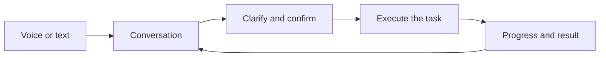

# How Nova works

Nova combines conversation with background work. You describe a task, Nova clarifies what is needed, and an executor such as Codex carries it out. You can keep talking while the task runs.

## From a request to a result

The conversation model interprets your request. Nova manages project selection, permissions and task state. Executors perform the actual work and report progress and results.

Creating or switching projects requires confirmation. Permission requests belong to a specific operation; a previous approval does not automatically authorize unrelated work. Recognition failure is not treated as approval, rejection or cancellation.

## Projects and sessions

A **project** is a working directory. A **session** is a Codex conversation within that project. Project files and session records let you resume work later.

Requests to change a running task are kept separate from new tasks. Cancelling work does not delete its project or conversation history. Disconnecting a phone does not cancel computer-side work.

## Voice and interruptions

The default **integrated** mode uses Qwen to process speech directly. **Cascaded** mode connects speech recognition, a language model and speech synthesis as separate stages.

You can interrupt spoken output. Nova tracks each response so late audio and results are not mistaken for a newer reply. Recovering speech delivery does not mean executing the task again. Progress narration reports what happened; it cannot grant permission for another action.

## Memory and documents

| Information | Purpose |
|---|---|
| Conversation and task state | Keep the current interaction and running work consistent |
| Personal memory | Recall information from earlier conversations; local mem0 is the default |
| Document knowledge | Search files you explicitly import |

These stores have separate purposes. Remembered facts and retrieved documents are information, not instructions that can override your permissions. Local storage may still use remote models for extraction and embeddings. See [personal memory](personal-memory.md).

## Vision and external tools

Conversation vision is optional and requires a supported cascaded model. It captures an image for the submitted turn. Independent monitoring observes a selected camera for the condition you requested and releases it when monitoring ends.

MCP connects configured external services. Only selected tools are exposed. Nova does not silently add services or discard tools to fit a model's limits.

## Desktop and phone

The computer runs models, memory and task execution. The iPhone client handles input, playback, messages and approval controls, connecting to the computer's service.

Settings separate **Save** from **Restart**. Service changes take effect after restarting the backend; appearance and wake settings apply after saving. See the [setup guide](getting-started.md) and [phone connection guide](iphone.md).

## Developer reference

The [architecture series](archs/00-overview.md) explains runtime state, executor interfaces, memory, speech ownership and native vision. The [client protocol](protocols/client-v1.md) defines remote messages and control receipts.
