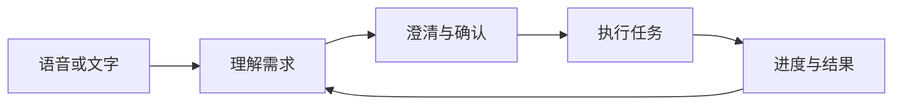

# 工作原理

Nova 把对话和后台任务连接起来。你描述需求，Nova 问清必要信息，再交给 Codex 等执行器处理。任务进行时，你仍然可以继续交流。

## 从需求到结果

对话模型理解需求；Nova 管理项目、权限和任务状态；执行器实际完成工作并返回结果。

创建或切换项目需要确认。权限请求只针对具体操作，不会因之前批准过其他事情就自动放行。识别失败不会被当作同意、拒绝或取消。

## 项目与会话

项目是工作目录，会话是该项目下的一段 Codex 交流。项目文件和会话记录支持之后继续工作。

补充正在执行的任务与新建任务分别处理。取消任务不会删除项目和会话记录，断开手机连接也不会取消电脑上的任务。

## 语音与打断

默认集成模式使用 Qwen 直接处理语音。级联模式把语音识别、语言模型和语音合成分开配置。

你可以打断播报。Nova 跟踪每次回复，避免把迟到的音频或结果混入新回复。恢复播报不会重新执行任务，进度播报也不能授权新的操作。

## 记忆与文档

| 信息 | 用途 |
|---|---|
| 对话与任务状态 | 保持当前交流和正在执行的工作一致 |
| 个人记忆 | 查询以前的对话信息，默认使用本地 mem0 |
| 文档知识库 | 检索你主动导入的文件 |

记忆和检索结果不具有授权效力。本地保存的数据仍可能发送给模型服务进行整理和向量化。详见[个人记忆](personal-memory.md)。

## 视觉与外部工具

对话视觉按需开启，需要支持图片的级联模型。独立监控按照你指定的条件观察选定摄像头，结束时释放设备。

MCP 连接已配置的外部服务，只开放选中的工具。Nova 不会为了迁就模型的数量上限而擅自添加服务或丢弃工具。

## 桌面与手机

电脑负责模型、记忆和任务执行；手机负责输入、播放、消息和审批操作。

设置中的保存与重启分开：服务配置重启后台后生效，外观和唤醒设置保存后生效。详见[上手指南](getting-started.md)和[手机连接](iphone.md)。

开发细节见[架构参考](archs/00-overview.md)与[客户端协议](protocols/client-v1.md)。
